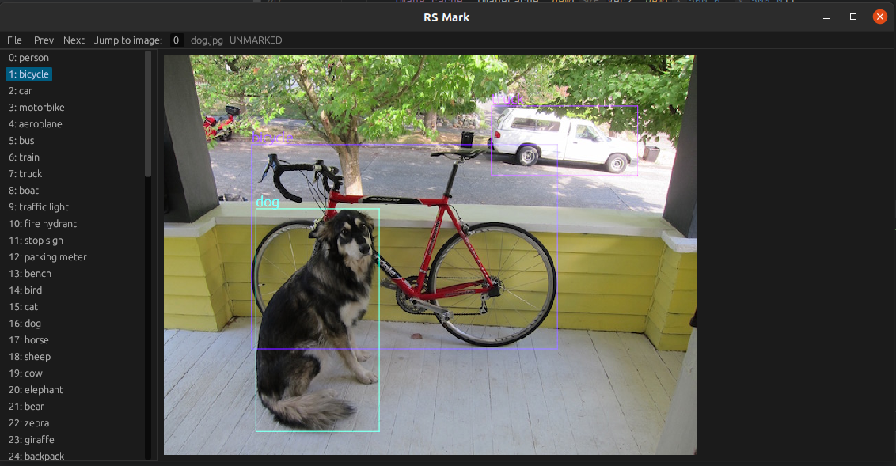

# Yolo Mark RS

I've drawn too many boxes in yolo_mark, its usable but has some rough edges:

- dependent on opencv (which can be a hassle to compile)
- Always selects the larger box on hover (cannot delete inner annotations)
- Slow with medium-large sized images
- Left/right arrow increments/decrements both image and tag
- Boxes have no transparency
- No custom keybindings (my implementation still not ideal in this regard but will be improved on)
- You can create 0 sized boxes
- cannot delete 0 sized boxes without clearing all other annotations

Other Labeling software is out there, (check out
[AlexeyAB list](https://github.com/AlexeyAB/darknet#how-to-mark-bounded-boxes-of-objects-and-create-annotation-files))
for some great alternatives that may suit you best. However, I've found
*__simplicity, speed and ease of install__* to be the most common deal-breakers for me.

So I've fixed these + some quality of life features of my own and this is the result.

# Neat Features

- Multikey tag shortcuts.
    - You can press 1 followed by 2 to go jump to tag 12. this is useful when one has more than 10 labels.
- "Marking" Images
    - Press `m` to add (or remove) an image path to a file called marked_\<timestamp\>.txt. I find this useful for
      marking images to be removed from the dataset without breaking the labeling workflow. its then trival to write a
      script to do what you wish with the marked images.
- Fast
    - Just try to scroll faster than the images are resized and displayed.

---

# Roadmap

I add features as I personally find certain tasks unergonomic or annoying, as a result this is pretty particular to my
use case. Suggestions and polite feedback are welcome if you find something missing.

- [x] Add a limit to the cache
- [x] Multi-digit names shortcuts
- [x] Change settings in GUI
- [X] Scroll to change name
- [ ] Drag boxes
- [ ] Resize Boxes
- [ ] Make trained network predict boxes and allow the user to correct them
- [ ] Show some annotation meta-data
- [ ] GPU acceleration?

# Running

I recommend installing the whole [toolchain](https://rustup.rs/) if you do not have a rust compiler already.

__Compile and Run:__\
`cargo run --release <path to images> <path to names file>`

On Linux there is also some extra libs needed for [egui](https://github.com/emilk/egui) (the graphics library this is
built on) to work; Debian-based distros you can run the following.

`sudo apt-get install libxcb-render0-dev libxcb-shape0-dev libxcb-xfixes0-dev libspeechd-dev libxkbcommon-dev`

For other distros installing these dependencies is left as an exercise to the reader.

# Keybindings

- `W` to go up a name
- `S` to go down
- `A` for prev image
- `D` for next.
- `C` clears all tags
- `R` removes the one you are currently hovered over (highlighted in white)
- `M` marks an image (see [features](#neat-features))

You can also scroll names with mousewheel (or however you poor trackpad people scroll)
as well as type out the index of the name you want to select (the timing threshold of which can be changed in settings)

# Known Issues

- Despite an image being loaded, it will not display until an event occurs forcing an update.
- Does not respect exif data (such as rotation)
- On Windows due to issue with imgui trying to persist window size, if you close the app while its minimized, when you
  open it back up it will start with a zero-sized window that cannot be scaled up. for now you can resolve this by
  removing the replacing `eframe = { version = "0.13.0", features = ["persistence"] }` with
  `eframe = { version = "0.13.0" }` which prevents the bug at the cost of not having settings files saved at regular
  intervals (which includes the image you left off from)

